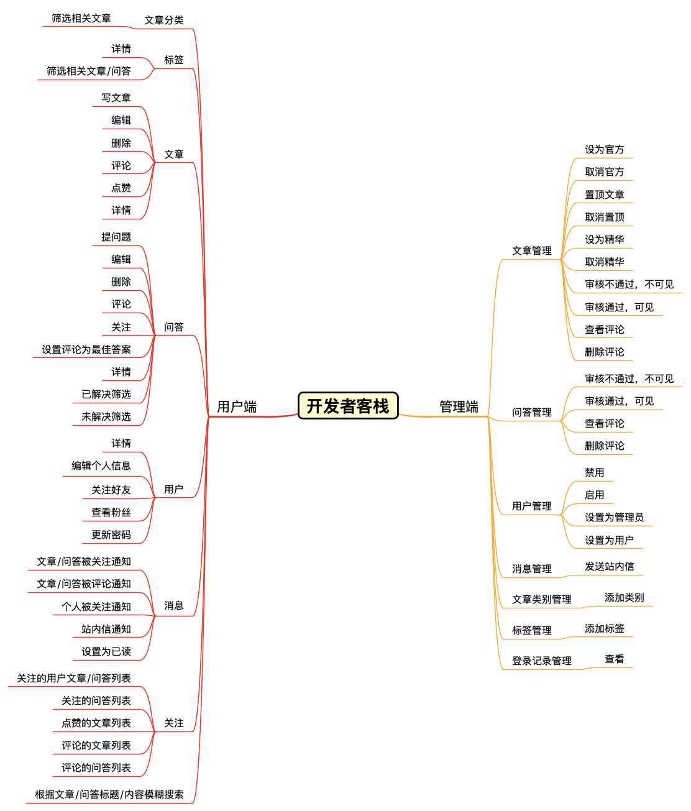
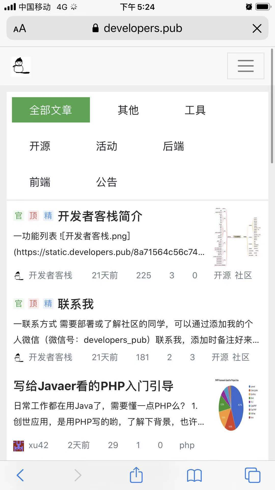
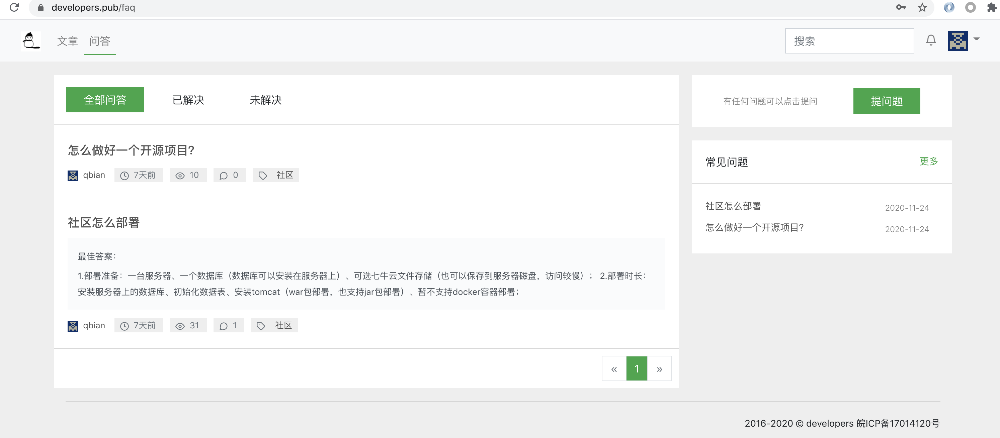
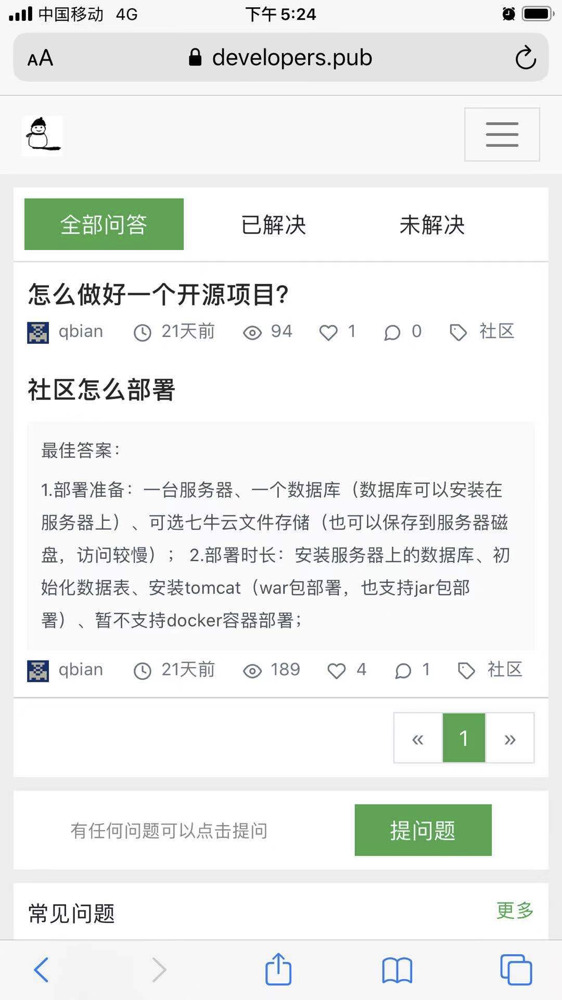
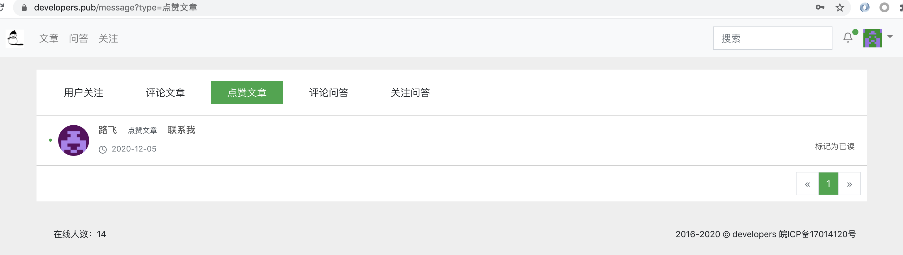
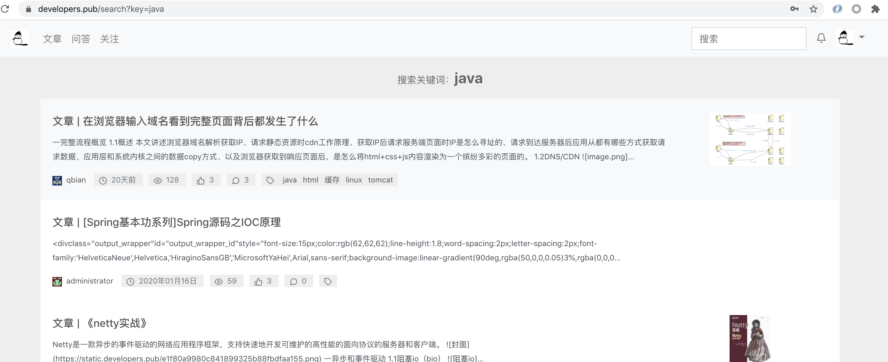
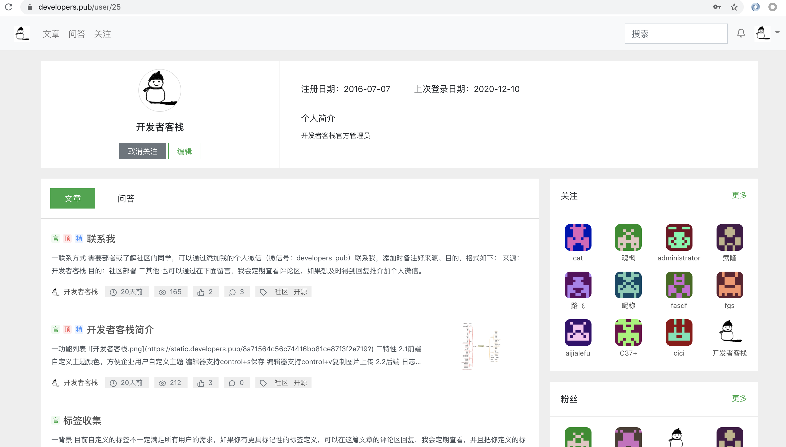
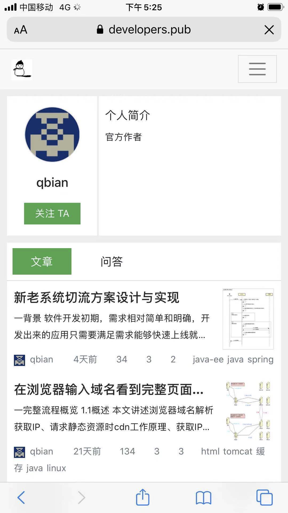
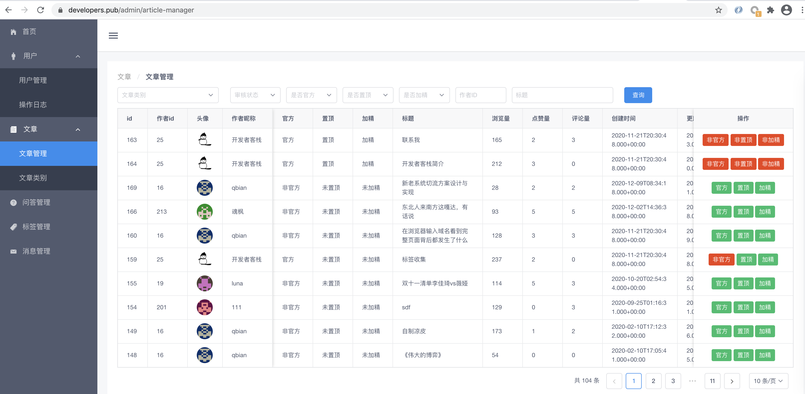

# forum-java
spring boot框架开发的社区：https://www.developers.pub

# 简介

[forum-java](https://www.developers.pub/) 是一个开源的现代化社区平台，它实现了：

- 面向内容讨论的论坛；
- 面向知识问答的社区；
- 100% 开源；


欢迎到 [开发者客栈](https://www.developers.pub/) 官方讨论区了解更多。同时也欢迎关注 开发者客栈 开源社区微信公众号 智猿其说：


# 为什么要做这个项目？

- PHP语言较多，Java的很少，目前spring boot开源的更是几乎没有，无法很好的接入公司内部系统；
- 很多社区功能过于简单，无法满足大部分需求；
- 界面风格老式，没有跟上时代发展的审美；
- 缺乏实际运营需求的功能，管理功能过于简单；


# 功能列表

```$xslt

用户端
    文章分类
        筛选文章
    标签
        查看详情
        筛选文章/问答
    文章
        写文章
        编辑
        删除
        评论
        点赞
        查看详情
    问答
        提问题
        编辑
        删除
        查看详情
        评论
        关注
        设置评论为最佳答案
        筛选已解决问题
        筛选未解决问题
    用户
        查看详情
        编辑个人资料
        更新登录密码
        关注好友
        查看粉丝
    消息
        文章/问答被关注通知
        文章/问答被评论通知
        个人被关注通知
        设置消息为已读
    关注
        关注的用户文章/问答
        关注的问答
        评论的问答
        点赞的文章
        评论的文章
    搜索
        根据文章/问答标题/内容模糊搜索
        
管理端
    用户管理
        禁用/启用
        设置为管理员/取消管理员
    操作日志
        操作类别筛选
    文章管理
        设置为官方
        设置为置顶
        设置为加精
        审核通过（可见）
        审核不过（不可见）
    文章类别管理
        审核通过（可见）
        审核不过（不可见）
        新增分类
    问答管理
        审核通过（可见）
        审核不过（不可见）
    标签管理
        审核通过（可见）
        审核不过（不可见）
        新增标签
```




#  特性

##  前端

- 多终端适配（手机端，pc端）
- 自定义主题颜色，方便企业用户自定义主题
- 编辑器支持control + s保存
- 编辑器支持control + v复制图片上传

##  后端

- 日志带有调用链，方便排查问题
- 分布式session，支持集群部署
- 用户角色权限分级，便于用户管理
- 接口权限校验，接口操作更安全

## 可扩展功能接口

- 文章/问答更新时自带审核，可接入审核中心便于运营管理
- 文件存储抽象接口，可支持自定义接入企业内部文件储存服务
- 缓存服务抽象接口，可支持自定义接入企业内部缓存服务
- 搜索服务抽象接口，可支持自定义接入企业内部搜索服务

# 技术栈

## 后端

- 数据库：mysql
- 持久层框架：mybatis
- 数据库连接池管理：hikaricp
- 数据库分页插件：github pagehelper
- mvc框架：spring mvc
- 应用层容器：spring boot
- json序列化工具：fastjson
- 邮件发送sdk：javax mail
- 七牛云存储sdk：qiniu java sdk
- 服务端页面渲染：thymeleaf

## 前端

- 前端markdown编辑器：mavon-editor
- 管理后台js框架：vue
- 用户端UI框架：bootstrap
- 管理后台UI框架 iview

# 部分页面展示

## 用户页面展示

- 首页





- 问答页








- 关注页


- 消息列表页




- 文章详情页


- 标签详情页


- 搜索页





- 用户主页








- 写文章页


## 管理后台页面




# 安装

请参考 [forum-java安装指南](https://www.developers.pub/article/171)。


# 授权

- 社区版：使用 MIT 开源，如果你选择使用社区版，则必须完全遵守 MIT 的相关条款；公司使用必须购买商用授权；
- 商业版：提供完整源码以便二开，报价 ¥16000；

**企业网站、经营性网站、以营利为目的或实现盈利的网站请购买商业版。**

